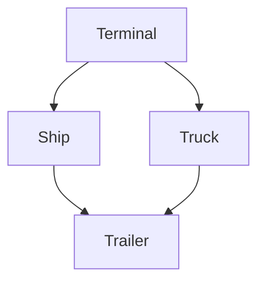
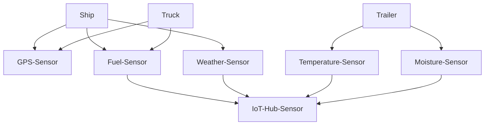

# Demo

The following demo shows how Crossplane and the Kubernetes ecosystem can be used to build digital twins in the logistics field.

## Digital Twins

A digital twin is a unique digital representation that serves as the real-time digital counterpart of a physical object or process. Digital twins mimic behavioral models in physical systems and offers a digital control plane for a physical world. It updates itself on it's state, condition and context. And provides value by visualization, analysis, prediction and optimization.

Digital twins are digital representations of physical assets
Digital twins mimic behavioral models in physical systems
Digital twins offers a digital control plane for a physical world
Digital twins tethers to their physical counterpart from cradle to grave


## Digital Twins in Shipping Logistics

Digital twins can be used for a variety for use-cases in shipping logistics. For the sake of this demo we'll focus on Trailers, Ships, Trucks and Trailers. 

Crossplane and the Kubernetes Ecosystem provides us with an incredible platform which we can use to build and operator digital twins.  

### Demo
Domain:


Sensor:


We will be demoing the following:

## 1. Install the Logistics Platform
```
# Investigate the existing CRDs
kubectl get crds

# Install the platform
kubectl apply -f apis/

# Investigate the Crossplane definitions
kubectl get xrds,compositions

https://github.com/luebken/platform-example-logistics/blob/main/apis/ship-xrd.yaml 

# Investigate the new CRDs
kubectl get crds | grep logistics
kubectl get crds xships.logistics.example.com -o yaml
```

## 2. Install Example Data

```
# Examples data. Domain specific CRs:
cat examples/*

watch kubectl get terminals,ships
kubectl apply -f examples/
```

## 3. How to enrich Digital Twins with Sensors

https://github.com/luebken/platform-example-logistics/blob/main/apis/ship-dummy-composition.yaml

https://github.com/luebken/provider-gps-dummy/blob/main/internal/controller/vesselgpstype/vesselgpstype.go#L133


## 4. How to query with Digital Twins
```
kubectl get terminal -l country=denmark
kubectl get ships -l terminal=copenhagen
kubectl get trucks -l terminal=copenhagen
kubectl get trucks -o=custom-columns='NAME:metadata.name,TERMINAL:metadata.labels.terminal'
```

## 5. How to update Digital Twins

```
kubectl get ships humber-viking
kubectl label ships humber-viking terminal=valencia --overwrite=true
kubectl get ships humber-viking
```

Outlook: Deploy a policy that updates the terminaal.

## 6. How to move Digital Twins
Dummy Import & Export
```
kubectl get containers xyz-987654321-ab -o yaml | yq eval 'del(.metadata.resourceVersion, .metadata.uid, .metadata.generation, .metadata.annotations, .metadata.creationTimestamp, .metadata.selfLink, .metadata.managedFields, .metadata.finalizers, .status, .spec.resourceRef)' - >export.yaml

# switch cluster
kubectl delete -f examples/

kubectl apply -f export.yaml
```

