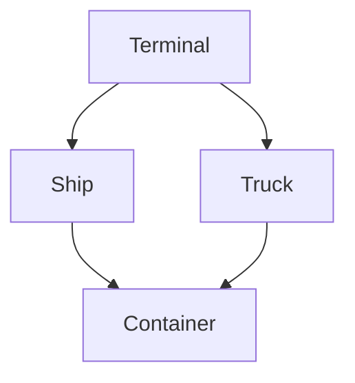
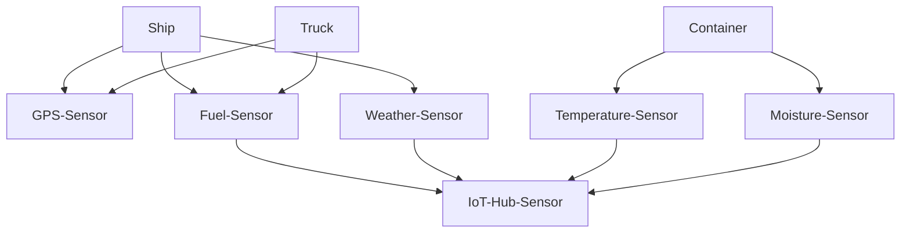
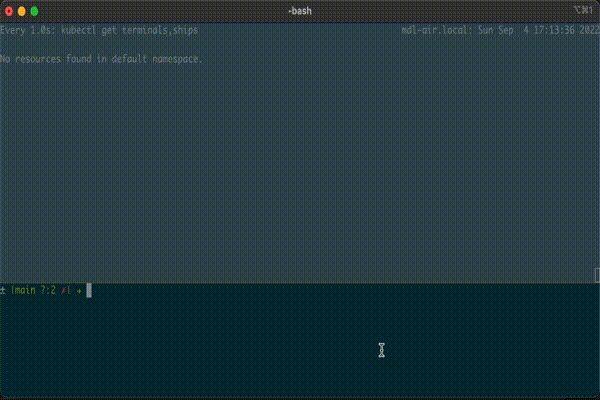
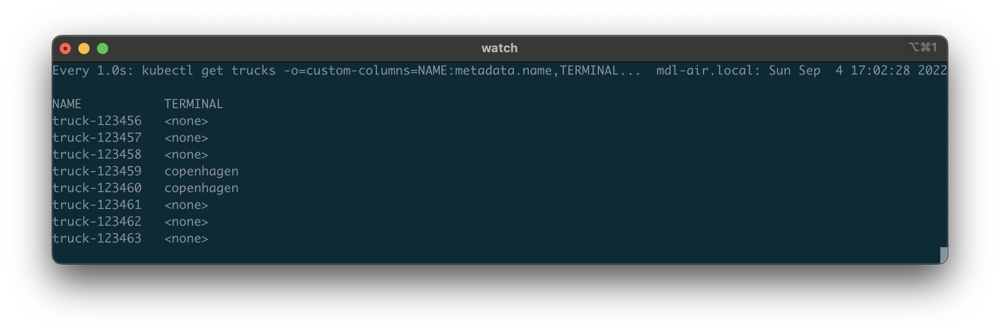
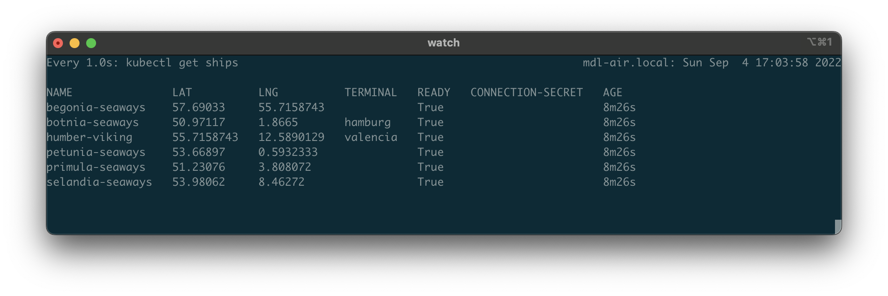

# Demo

The following demo shows how Crossplane and the Kubernetes ecosystem can be used to build digital twins in the logistics field.

## Digital Twins

A digital twin is a unique digital representation that serves as the real-time digital counterpart of a physical object or process. Digital twins mimic behavioral models in physical systems and offers a digital control plane for a physical world. It updates itself on it's state, condition and context. And provides value by visualization, analysis, prediction and optimization.

* Digital twins are digital representations of physical assets
* Digital twins mimic behavioral models in physical systems
* Digital twins offers a digital control plane for a physical world
* Digital twins tethers to their physical counterpart from cradle to grave


## Digital Twins in Shipping Logistics

Digital twins can be used for a variety for use-cases in shipping logistics. For the sake of this demo we'll focus on Terminals, Ships, Trucks and Containers. 

Crossplane and the Kubernetes ecosystem provides us with an incredible platform which we can use to build and operator digital twins.  

### Demo
Domain:


Sensor:


We will be demoing the following:

## 0. Pre-requisites
See [readme.md](readme.md)

```
# K8s cluster with Crossplane installed
helm list -n upbound-system
kubectl get pods -n upbound-system

# Cleanup previous demo
kubectl delete -f examples/
kubectl delete -f apis/
```

## 1. Install the Logistics Platform
```
# Investigate the existing CRDs 
# which are mainly defining the Crossplane runtime
kubectl get crds

# List the avaible providers
kubectl get providers

# Install the platform
kubectl apply -f apis/

# Investigate the Crossplane API definitions
# which define a terminal, ship, truck and container 
kubectl get xrds

# and their implementations
kubectl get compositions
kubectl get compositions xships-dummy -o yaml

# Investigate the new CRDs / APIs
kubectl get crds | grep logistics
kubectl get crds xships.logistics.example.com -o yaml
```

## 2. Install Example Data

```
# Install some examples data. 
# Some terminals, ships, trucks and containers
cat examples/*

# Watch terminals and ships.
# As these sensors get online more information is 

watch kubectl get terminals,ships
kubectl apply -f examples/
```



## 3. How to enrich Digital Twins with Sensors

kubectl apply -f apis/ship-dummy-composition.yaml

https://github.com/luebken/provider-gps-dummy/blob/main/internal/controller/vesselgpstype/vesselgpstype.go#L133


## 4. How to query with Digital Twins
```
kubectl get terminal -l country=denmark
kubectl get ships -l terminal=copenhagen
kubectl get trucks -o=custom-columns='NAME:metadata.name,TERMINAL:metadata.labels.terminal'
```



## 5. How to update Digital Twins

```
kubectl get ships
kubectl label ships humber-viking terminal=valencia --overwrite=true
kubectl get ships
```



<!-- Outlook: Deploy a policy that updates the terminal.-->

## 6. How to move Digital Twins

watch kubectl get container

Dummy Import & Export
```
kubectl get containers xyz-987654321-ab -o yaml | yq eval 'del(.metadata.resourceVersion, .metadata.uid, .metadata.generation, .metadata.annotations, .metadata.creationTimestamp, .metadata.selfLink, .metadata.managedFields, .metadata.finalizers, .status, .spec.resourceRef)' - >export.yaml

# switch cluster
kubectl delete -f examples/

kubectl apply -f export.yaml
```

